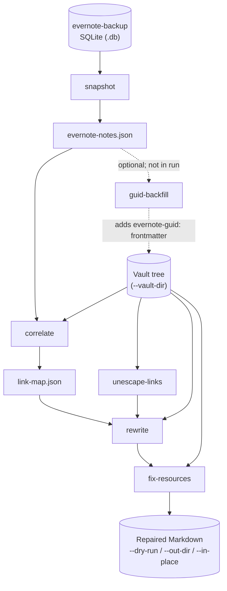

# EDD: Evernote → Obsidian link repair

**Status:** Completed  
**Last updated:** 2026-05-30 (marked complete; CLI architecture superseded — see below)  
**Active planning:** [Run-centric CLI EDD](./2026-05-30-run-centric-cli.edd.md) ([#87](https://github.com/thomasvanlankveld/evernote-obsidian/issues/87))

> **Supersedes (partial):** §4 *High-level architecture* and command-first CLI framing are replaced by the [run-centric EDD](./2026-05-30-run-centric-cli.edd.md). **Phases 2–6 implementation notes** in this document remain the reference for correlation, link extraction, rewrite, and safety behavior.

## EDD phase completion (before you push / open a PR)

When implementation for a phase is done on your branch: run **`npm test`** (and **`npm run build`** / **`npm run lint`** if you touched code), then in **this EDD** tick that phase’s checkbox(es) and bump **Last updated** if the plan changed. Keep EDD edits in the **same branch** as the code so reviewers see intent and execution together. Agents: canonical checklist in [AGENTS.md](./AGENTS.md) in this folder.

## 1. Context

Exporting Evernote to `.enex` and importing with Obsidian’s Importer preserves content but often leaves **internal links** as **`evernote://…`** URLs or **`https://www.evernote.com/shard/…`** web links. Importers lack stable crosswalk from those URLs to the Markdown files actually created ([obsidian-importer#306](https://github.com/obsidianmd/obsidian-importer/issues/306)).

This project adds automation: **correlate Evernote note identity → vault file**, then **rewrite links** in bulk.

## 2. Goals

- Build a **repeatable CLI-oriented pipeline** (Node ≥24, per repo).
- Support **dry-run** and **safe defaults** (no silent data loss).
- Keep **secrets and personal notes out of git** (backup databases, `.env`, vault under `data/` or configurable path).

## 3. Non-goals (initially)

- Replacing Obsidian Importer or parsing full ENML for a full re-import.
- Perfect resolution of every edge case without human **override** input.
- GUI or Obsidian plugin (CLI / scripts only unless explicitly expanded later).

## 4. High-level architecture

The pipeline is a **sequence of CLI commands** that produce artifacts and then repair Markdown under **`--vault-dir`**. You can invoke each command yourself, or use **`run`** to execute the same repair chain in one process (see below).

### Pipeline (step by step)



**Prepare crosswalk:** `snapshot` exports note GUID + title from the backup DB. `correlate` joins that snapshot to vault files (by `evernote-guid:` when present, else normalized title) and writes **`link-map.json`**.

**Repair vault:** `unescape-links` fixes importer-escaped external links, then **`rewrite`** replaces Evernote note URLs with wikilinks using the map, then **`fix-resources`** normalizes importer `_resources/` embed paths. Output mode (`--dry-run`, `--out-dir`, `--in-place`) applies to the repair commands. The diagram shows inputs from the live **`--vault-dir`** tree; with **`--out-dir`**, **`run`** passes each step’s mirror to the next (e.g. **`rewrite`** reads from **`unescape-links`** output when both use the same **`--out-dir`**).

**Off the main path (optional):**

- **`guid-backfill`** — after a successful correlate, write missing `evernote-guid:` frontmatter so later correlates prefer GUIDs (run manually once; not part of `run`).
- **`check`**, **`index`**, **`links`** — preflight or report-only; no link map, no writes to the repair chain.

### How `run` relates

**`evernote-obsidian run` is not another pipeline stage.** It is a convenience wrapper that calls the **same implementations** as the standalone commands, in order:

1. `snapshot` — skipped if you pass **`--snapshot`** (reuse existing JSON) or **`--map`** (skips snapshot and correlate)
2. `correlate` — skipped if you pass **`--map`** (reuse existing link map)
3. `unescape-links` — optional skip via **`--skip-unescape-links`**
4. `rewrite`
5. `fix-resources`

When **`--db`** or **`--snapshot`** is set, `run` also prints Evernote-vs-vault count hints on stderr (same family as **`check`**); that preflight does not replace `correlate`.

To reach the same end state **without** `run`, run the commands above yourself in that order (after `npm run build`). Use individual commands when you want to inspect **`evernote-notes.json`** / **`link-map.json`** between steps, retry one step, or run **`guid-backfill`** between correlate and rewrite.

**CLI vault root:** **`--vault-dir <path>`** on all vault-touching commands (default **`./data`**). **`--vault`** is a deprecated alias.

## 5. Implementation phases

### Phase 1 — Scaffold

- [x] **TypeScript**, compile to **`dist/`**, **Node ESM**; `src/`, CLI entry (`package.json` `bin` or `node dist/cli.js`); optional `tsx` for local dev.
- [x] Scripts: `build`, `lint`, `test`, `dev`.
- [x] `.env.example` for optional local defaults; align `.gitignore` with build dirs (`/dist/`, `/out/`, reports if written under repo).

### Phase 2 — Vault index (read-only)

- [x] Walk configurable vault root; **CLI default** is **`./data`** (cwd-relative), overridable with **`--vault-dir`** (`evernote-obsidian index`; **`--vault`** alias).
- [x] Index Markdown files: path, **normalized title** from filename and optional YAML frontmatter (`title:`).
- [x] **Correlation key (v1):** normalized **title** (Obsidian Importer filename rules, then NFC / lowercase / whitespace); **v1.1:** optional frontmatter **`evernote-guid:`** (line-based scalar, lowercase in index).
- [x] **Duplicate titles:** **fail** with a report listing collisions — **no** silent first-wins.
- [x] **Duplicate `evernote-guid:` values** in the vault: **fail** with `guidCollisions` (same no-silent-wins rule).

**Phase 2 implementation notes**

- **Frontmatter `title:` / `evernote-guid:` (v1):** line-based subset only (first scalar line per key, optional simple quotes), not full YAML — no block scalars, aliases, or other keys. GUIDs are normalized to lowercase in the index.
- **Title normalization** mirrors Obsidian Importer [`sanitizeFileName`](https://github.com/obsidianmd/obsidian-importer/blob/master/src/util.ts) for correlation keys (implemented in `sanitizeObsidianImporterFileName` / `normalizeTitle`): slash and backslash → `-`, illegal path chars (`? < > : * | "`) and control chars removed, **`badLinkRe`** (`[ ] # | ^` removed), leading/trailing whitespace trimmed via `.trim()`, then NFC, lowercase, collapsed whitespace.
- **Truncation:** when an exact normalized title match fails, **`correlate`** may match a **unique** vault filename stem that is a **strict prefix** of the snapshot normalized title (Importer/OS truncation; minimum stem length **12**). Ambiguous prefixes fail closed (`truncatedPrefixCollisions`); audit via `truncatedTitleMatches` in `link-map.json` and **`correlate-report.json`**. Stems that still do not qualify → unmatched; use **`correlation-overrides.json`** (`byGuid`).
- **Remaining edge cases:** punctuation the Importer leaves unchanged (e.g. em dash `—` vs hyphen `-`) can still diverge from Evernote DB titles; notes never imported into the vault have no file to match — use overrides or re-import, not silent correlation.
- **Empty normalized title** (e.g. filename stem trims to nothing): **invalid**; index fails with the same collision-shaped report shape (`normalizedTitle: ""`).
- **Symlinks:** **symlinked directories are not recursed** (avoids cycles); a regular file that is a symlink is still indexed. Layouts that rely on symlinked folders for notes are unsupported in v1.
- **CLI:** `--vault-dir` requires a path when the flag is present (`--vault` alias); other I/O errors surface as **exit 2** and a short message (not only missing root).
- **Skipped directories (by name):** `.git`, `node_modules`, `.obsidian`, `.trash` — not recursed; symlinked directories still not followed.

**Deliverable:** `buildVaultIndex(root)` + fixture tests. ✅

### Phase 3 — Evernote metadata (evernote-backup SQLite)

Produce a **gitignored JSON snapshot** of note metadata (**GUID**, **title**, plus a placeholder **`updated`**) from a local **[evernote-backup](https://github.com/vzhd1701/evernote-backup)** SQLite database so later phases can correlate vault files to Evernote identities. **Phase 4+ numbering stays unchanged** (link extraction remains Phase 4).

- [x] **`snapshot --db <path>`** reads **`notes.guid`** and **`notes.title`** (read-only `node:sqlite`); writes the same envelope shape as before. **`host`** in the JSON is the literal **`evernote-backup`** (metadata origin label, not an API hostname).
- [x] **Trash** (`is_active = 0`) excluded; **`is_active` NULL** (in-progress sync rows) treated as active.
- [x] **`updated`:** Evernote’s real update time is only inside Python-pickled `raw_note` in upstream’s schema; this CLI does not unpickle. Every **`NoteRecord.updated`** is the sentinel **`1970-01-01T00:00:00.000Z`** (documented in README and types). Title-only correlation (Phase 5) is unaffected.
- [x] Optional **`--max-notes`** caps output volume; stdout summary includes **`sourceRowCount`** and **`truncated`** when the cap cuts rows.

**Deliverable:** `NoteRecord[]` + fixture tests + `snapshot` CLI. ✅

**Phase 3 implementation notes**

- **CLI:** `evernote-obsidian snapshot --db <path> [--out <path>] [--max-notes <n>]` — default **`./out/evernote-notes.json`**. No Evernote API credentials in this repo.
- **On-disk shape:** `{ version: 1, writtenAt, host, notes: NoteRecord[] }` unchanged. **`host`** is **`evernote-backup`** for this source.
- **Upstream schema:** expects `notes` table per evernote-backup’s `DB_SCHEMA` (`guid`, `title`, `is_active`, …). If the file is not that format, fail fast.

### Phase 4 — Link extraction

- [x] Per `.md`, find **note** URLs: **`evernote://…`** and **`https://www.evernote.com/shard/…`**; normalize each to **GUID** for the link map. Other **`*.evernote.com`** hosts (e.g. blog): **do not rewrite** — report or skip per CLI.
- [x] **Skip code spans:** fenced (`` ``` `` / `~~~`) and inline (`` `…` ``) regions are excluded from discovery so `rewrite --in-place` does not turn documentation literals into wikilinks; `links` uses the same rules.
- [x] Capture **display text / alias** when the import left one (e.g. existing `[[alias]]`-style segments or markdown link text) so rewrites can use **`[[path|alias]]`** without changing what readers see.
- [x] Emit **report only**: file, location, raw URL, parsed id, alias when possible.

**Deliverable:** `BrokenLink[]` JSON or stdout; no writes. ✅

### Phase 5 — Correlation

- [x] Join Evernote records to vault index by **`evernote-guid:` frontmatter when present**, else **normalized title**, plus **user override file** for collisions and renames.
- [x] Emit **link map**: **GUID → vault-relative path** to the target note file (all extracted note URLs normalize to a GUID). Rewrites combine this path with the **alias** from extraction into **`[[path|alias]]`**.

**Deliverable:** `link-map.json` (default gitignored unless sanitized). ✅

**Phase 5 implementation notes**

- **CLI:** `evernote-obsidian correlate --snapshot <path> [--vault-dir <path>] [--overrides <path>] [--out <path>] [--map-out <path>] [--report <path>] [--verbose]` — default **`./out/link-map.json`**, vault default **`./data`** (`--vault` alias).
- **Optional GUID backfill (`guid-backfill`, #68):** `evernote-obsidian guid-backfill --snapshot <path> [--vault-dir <path>] [--overrides <path>] [--dry-run | --in-place] [--report <path>] [--verbose]` — correlates like **`correlate`**, then inserts lowercase **`evernote-guid:`** frontmatter when missing (never overwrites a conflicting existing GUID). **`--dry-run`** is the default; **`--in-place`** writes via atomic replace. **Not** part of **`run`** — run explicitly once after import if you want stable GUID-based correlation on later runs.
- **GUID map keys:** Evernote note GUIDs in snapshots, `guidToPath` / `link-map.json`, and override `byGuid` keys are always stored **lowercase** (normalized at ingestion). Link extraction lowercases GUIDs parsed from URLs before lookup; this keeps in-memory and on-disk maps aligned.
- **Overrides JSON:** `{ "version": 1, "byGuid": { "<guid>": "<vault-relative-path>" } }` — paths must match an indexed `.md` path (POSIX separators). **Evernote duplicate titles** (multiple GUIDs sharing the same normalized title) require **`byGuid` for every GUID** in that group.
- **Truncated filename stems:** same prefix-matching rules as Phase 2 (**`truncatedTitleMatches`** in **`link-map.json`**; **`truncatedPrefixCollisions`** on ambiguity).
- **Failure cases (exit 1):** vault index title/`evernote-guid` collisions (same as `index`); **unmatched** snapshot rows; **invalid** override paths; **duplicate target paths** (two GUIDs resolved to the same vault file); **Evernote title collisions** without resolvable GUIDs/overrides; **`guidTitleMismatches`** when frontmatter GUID and title-based resolution disagree; **`truncatedPrefixCollisions`**. By default stderr shows a one-line hint plus compact counts; full arrays are written to **`./out/correlate-report.json`** (**`--report`**). **`--verbose`** / **`--report-stdout`** also print the full JSON on stderr (legacy scripting).

### Phase 6 — Rewrite

- [x] CLI: **`--vault-dir`** (default `./data`; **`--vault`** alias), **`--map`**, **`--dry-run`**, **`--out-dir`** vs **`--in-place`** (with optional **`--backup`**).
- [x] **`unescape-links`** and **`fix-resources`** repair importer-specific Markdown/embed paths; chained by **`run`** after correlate (see README / `usage()`).
- [x] Replace Evernote **note** URLs with **`[[path|alias]]`** (vault-relative path + captured alias); preserve surrounding Markdown where possible.
- [x] **`--in-place`:** same-directory temp file + **`fsync`** + **`rename`** (atomic replace on typical local disks; not guaranteed on all network/sync mounts).

### Phase 7 — Hardening

- [x] Golden-file tests on miniature vaults.
- [x] Encoding / Unicode / punctuation in titles; percent-encoding in URLs.
- [x] README: commands, security reminders.

## 6. Risks

| Risk                                       | Mitigation                                                           |
| ------------------------------------------ | -------------------------------------------------------------------- |
| Title mismatch after Importer sanitization | Full Importer `sanitizeFileName` + `badLinkRe` in `normalizeTitle` (#72); truncation policy via unique strict-prefix correlate (#73); **`correlation-overrides.json`**; optional **`guid-backfill`** (#68); full detail in **`./out/correlate-report.json`** (`--report`; `--verbose` for stderr) |
| Importer/OS filename truncation (stem shorter than Evernote title) | Unique strict-prefix correlate (min stem 12, #73); audit via `truncatedTitleMatches` / **`correlate-report.json`**; ambiguous prefixes fail; else **`byGuid`** override |
| Duplicate titles                           | Fail with report; overrides required until unambiguous               |
| Stale backup vs Obsidian import                    | Re-run `evernote-backup sync` before `snapshot`; document refresh cadence |
| evernote-backup DB format drift                    | Fail fast on missing `notes` table; pin upstream schema in tests / README     |
| Wrong rewrites                             | Dry-run default; golden tests; backup before in-place                |
| Torn in-place write on crash               | Temp file + atomic rename; backup for logical rollback               |

## 7. References

- [Import from Evernote – Obsidian Help](https://obsidian.md/help/import/evernote)
- [evernote-backup (SQLite backup tool)](https://github.com/vzhd1701/evernote-backup)
- [obsidian-importer#306](https://github.com/obsidianmd/obsidian-importer/issues/306)
- Repo README: `/README.md`
- EDDs for this repo: `/docs/edds/` (filenames: `YYYY-MM-DD-<slug>.edd.md`)
