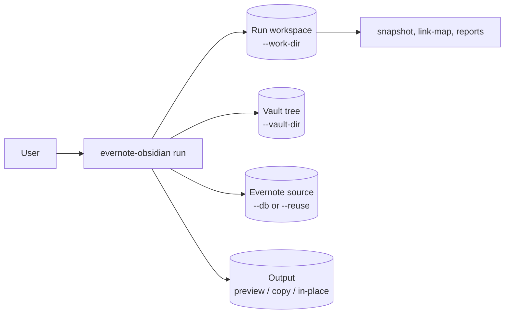
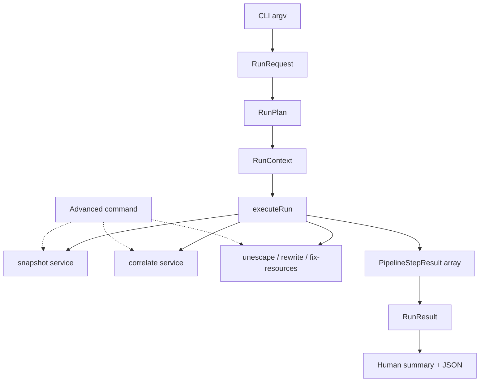

# EDD: Run-centric CLI (UX simplification & architecture)

**Status:** Draft  
**Last updated:** 2026-05-30  
**Tracks:** [GitHub #87](https://github.com/thomasvanlankveld/evernote-obsidian/issues/87)

## EDD phase completion (before you push / open a PR)

When implementation for a phase is done on your branch: run **`npm test`** (and **`npm run build`** / **`npm run lint`** if you changed code), then in **this EDD** tick that phase’s checkbox(es) and bump **Last updated** if the plan changed. Keep EDD edits in the **same branch** as the code so reviewers see intent and execution together. Agents: canonical checklist in [AGENTS.md](./AGENTS.md) in this folder.

## 1. Context

The [migration EDD](./2026-05-10-evernote-obsidian-migration.edd.md) delivered a working link-repair pipeline: snapshot → correlate → unescape-links → rewrite → fix-resources. That work is **complete** (Phases 1–7).

Docs and code still present the tool as **many peer commands** you compose by hand. In practice the user journey is: **run one command, get repaired Markdown (or a clear blocker)**. Issue #87 reframes the product and internal architecture around that journey.

**Domain rules unchanged:** correlation keys, link extraction, rewrite safety, and report shapes documented in the migration EDD (especially Phases 2–6 notes) remain authoritative unless this EDD explicitly revises them.

**Pre-1.0 policy:** There are no external consumers yet. Prefer **clean CLI breaks** over long deprecation periods. Update tests and README in the same PR as flag or output changes.

## 2. Goals

- Make **`evernote-obsidian run`** the **primary product surface** (README, `usage()`, mental model).
- Collapse artifact path flags into a **run workspace** (`--work-dir`).
- Refactor orchestration around **`RunRequest` → `RunPlan` → `RunContext` → `RunResult`** so `run` is the stable API and phase commands are thin debug entry points.
- Default output answers **“am I done?”** and **“what next?”** (outcome-first messaging), not “which pipeline step ran?”
- Keep **safe defaults** (preview unless the user explicitly writes).

## 3. Non-goals

- Changing correlate / rewrite / link-extraction semantics (unless a bug fix).
- Obsidian plugin or GUI.
- **`guid-backfill` inside `run` by default** (stay explicit; optional flag later).
- Supporting every legacy flag forever — remove redundant paths once the run workspace lands.

## 4. Target architecture

### User-facing model



**Typical invocation:**

```bash
evernote-obsidian run --vault-dir ./imported --db ./en_backup.db
evernote-obsidian run --vault-dir ./imported --db ./en_backup.db --out-dir ./fixed
```

**Advanced / debugging:** `snapshot`, `correlate`, `rewrite`, `unescape-links`, `fix-resources`, `check`, `index`, `links`, `guid-backfill` — same underlying services, not the primary documentation path.

### Internal model



| Type | Responsibility |
| ---- | -------------- |
| **`RunRequest`** | Parsed user intent: vault root, Evernote source, output mode, work dir, reuse/skip flags. |
| **`RunPlan`** | Resolved execution: which phases run vs skip, artifact paths under work dir, preflight policy. |
| **`RunContext`** | Mutable runtime: cwd, streams, progress/quiet, paths passed into phase services. |
| **`RunResult`** | Outcome for reporting: `outcome`, impact counts, blockers, suggested next step; derived from step results + output mode. |

Phase services (`runSnapshot`, `runCorrelate`, `runUnescapeLinks`, `runRewrite`, `runFixResources`) stay as today’s implementations initially; **`executeRun`** owns ordering and early exit.

### Run workspace (`--work-dir`)

Default: **`./out`** (gitignored). The run owns:

| Artifact | Default path (under work dir) |
| -------- | --------------------------- |
| Evernote snapshot | `evernote-notes.json` |
| Link map | `link-map.json` |
| Correlate failure report | `correlate-report.json` (+ `.md` unless disabled) |
| Optional overrides input | user-supplied path (not owned by work dir) |

**Reuse:** `--reuse` skips regenerating snapshot and/or link map when files already exist in the work dir (replaces ad-hoc `--snapshot` / `--map` combinations where possible).

**Fresh:** `--fresh` clears or ignores cached artifacts in the work dir before running (exact behavior: delete known artifact filenames, not the whole tree).

Remove redundant path flags from **`run`** once `--work-dir` lands (`--out`, `--map-out`, `--snapshot-out` on run, etc.). Phase commands may keep explicit `--out` for debugging.

### Output modes (user intent)

| Intent | Flags (current → target) |
| ------ | ------------------------ |
| Preview | default / `--dry-run` |
| Write copy | `--out-dir <path>` |
| Apply in vault | `--in-place` (+ `--backup` recommended) |

No alias layer required unless we find a naming win worth the extra surface.

### Run result messaging

**Human (TTY stdout):** outcome line, impact line, next-step line when applicable. Step checklist only with **`--verbose`**.

Examples:

```text
Preview complete — 218 link replacements in 93 files; 12 unescape fixes; 4 resource paths.
No blocking issues.

Next: evernote-obsidian run … --out-dir ./fixed-vault
```

```text
Blocked — 3 title collisions prevented correlation.

Report: ./out/correlate-report.md
Next: add overrides (see report) or run guid-backfill after fixing titles.
```

**`--json`:** run-centric top-level object (`ok`, `outcome`, `impact`, `blockers`, `next`, `workDir`, …). Include `steps` for debugging; scripts should prefer top-level fields.

**Non-TTY stdout:** JSON (same shape as `--json`).

## 5. Target CLI surface (`run`)

```
evernote-obsidian run --vault-dir <path>
  [--db <path>]              # build snapshot (unless --reuse has one)
  [--work-dir <path>]        # default ./out
  [--reuse | --fresh]
  [--overrides <path>]
  [--max-notes <n>]
  [--skip-unescape-links]
  [--dry-run | --out-dir <path> | --in-place [--backup]]
  [--json | --json-steps] [-q] [--progress] [--verbose]
  [--no-report-md]           # correlate failure: skip .md report
```

**Required:** `--vault-dir` and (`--db` or reusable snapshot in work dir with `--reuse`).

Advanced commands keep their current flags for isolated debugging; README lists them under **Advanced**.

## 6. Implementation phases

### Phase 1 — `RunResult` and outcome reporting

- [ ] Add `buildRunResult(steps, options)` → `RunResult` (`src/cli/runResult.ts` or similar).
- [ ] Add `formatRunSummary(result, cwd)` for human output; wire `emitRunReport` to summary-first default.
- [ ] Add **`--verbose`** on `run` to print the legacy step checklist.
- [ ] Reshape **`--json`** to run-centric top-level fields; keep `steps` array.
- [ ] Tests: unit tests for `RunResult` (preview success, out-dir success, correlate blocked, generic failure); update `pipelineE2E` JSON assertions.

**Deliverable:** Users see outcome-first output; tests lock the new contract.

### Phase 2 — Run workspace

- [ ] Add **`--work-dir`**, **`--reuse`**, **`--fresh`** to `run`.
- [ ] Centralize artifact paths (`resolveRunWorkspace(workDir)`).
- [ ] Remove redundant **`run`** path flags (`--out`, `--map-out`, `--snapshot-out`, input `--snapshot` / `--map` on run — or reduce to `--reuse` only).
- [ ] Tests: work-dir path matrix; E2E run with `--work-dir` + `--reuse`.

**Deliverable:** One directory owns intermediate artifacts; simpler argv for `run`.

### Phase 3 — Product framing (docs)

- [ ] README: **Quick start** = `run` only; **Advanced** = phase commands.
- [ ] `usage()`: `run` first; shorten advanced command section.
- [ ] Link README to this EDD for architecture.

**Deliverable:** Public docs match run-centric model.

### Phase 4 — Orchestration refactor

- [ ] Introduce `RunRequest`, `RunPlan`, `RunContext` types.
- [ ] Extract **`executeRun(ctx)`** from `runCommand.ts`; `runRun` = parse → plan → execute → report.
- [ ] Phase CLI handlers call shared services; avoid duplicating skip/reuse logic.
- [ ] Tests: existing `pipelineE2E` + `main.test.ts` stay green (adjust for flag removals from Phase 2).

**Deliverable:** Architecture matches §4 internal model; `runCommand.ts` is thin.

### Phase 5 — Polish (optional, separate PRs)

- [ ] Plain-language progress lines (“Matching notes…”, “Rewriting links…”).
- [ ] Optional `--guid-backfill` pre-step on `run` (explicit opt-in).
- [ ] Write `run-summary.json` into work dir for automation.

## 7. Testing strategy

| Layer | Purpose |
| ----- | ------- |
| **Unit** | `RunResult` builder, work-dir path resolver, argv parsing for new flags. |
| **Integration** | `pipelineE2E.test.ts`: full `run` still produces correct vault output. |
| **CLI** | `main.test.ts`: adjust as flags change; no wholesale rewrite required. |
| **Domain** | Existing correlate / rewrite / vault tests unchanged. |

Add **`RunResult` unit tests before Phase 4.** Do not move all command tests behind `run` only.

## 8. Risks

| Risk | Mitigation |
| ---- | ---------- |
| Refactor breaks step handoff (`--out-dir` chain) | Keep `pipelineE2E`; run Phase 4 only after Phases 1–2 green. |
| JSON consumers break | Pre-1.0: update tests in same PR; document shape in this EDD. |
| Over-scoped flag churn | Phase 2 removes flags only on **`run`**, not all advanced commands at once. |
| Failure messaging too vague | Correlate failures must always include report path + one concrete next step. |

## 9. References

- [GitHub #87 — Make the tool run-centric](https://github.com/thomasvanlankveld/evernote-obsidian/issues/87)
- [Migration EDD](./2026-05-10-evernote-obsidian-migration.edd.md) — completed pipeline; domain rules (Phases 2–6 notes)
- Repo README: `/README.md`
- EDDs for this repo: `/docs/edds/` (filenames: `YYYY-MM-DD-<slug>.edd.md`)
